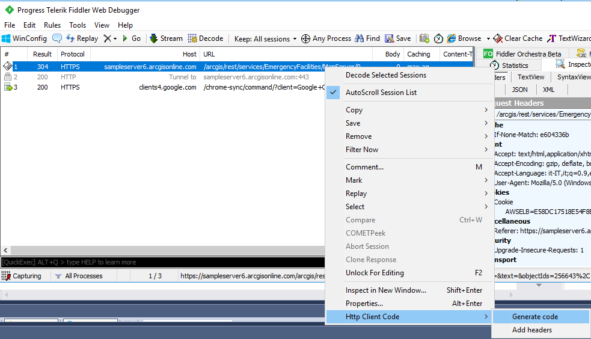
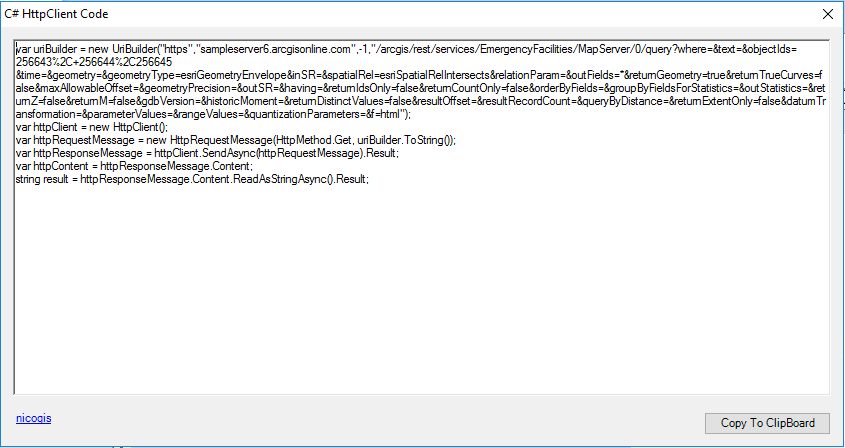
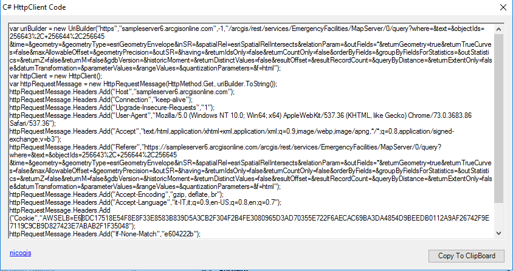
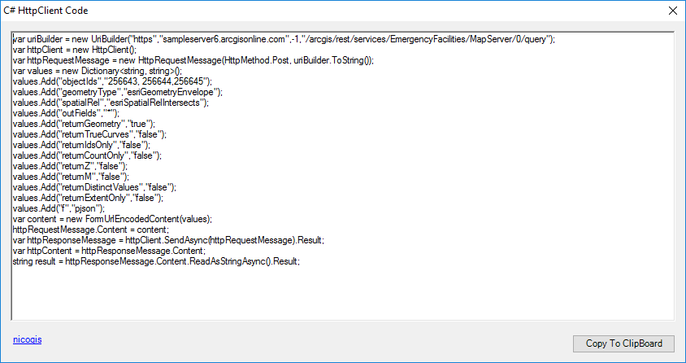
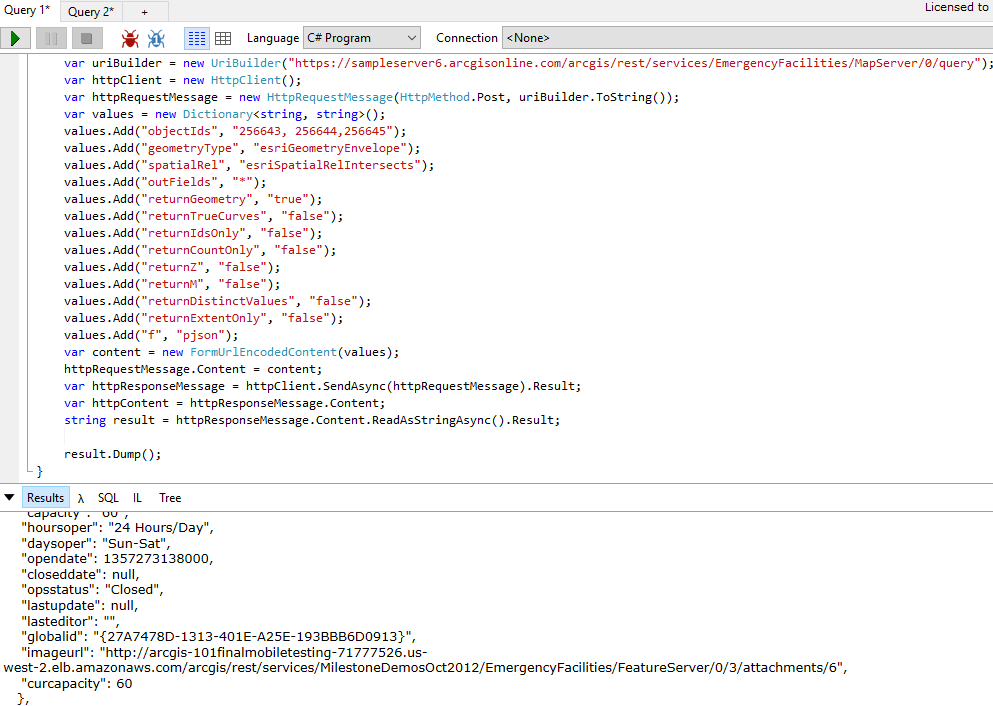

### Description
This Fiddler extension generates C# (.Net Framework 4.5) HttpClient code.

### Requirements
Fiddler 4.0

### Installation

- Copy HttpClientCode.dll from the bin folder to your %USERPROFILE%\Documents\Fiddler2\Scripts folder.
- You'll need to restart Fiddler if it's already running.

Select the request 
Select <b>Http Client Code</b> from context menu

Click <b>Generate Code</b>
Here you can see sample GET from rest service arcgis

If you need headers you can checked <b>Add headers</b>

Here you can see sample POST from rest service arcgis

Click button <b>Copy to Clipboard</b>

Paste from Clipboard and test with LinPad

